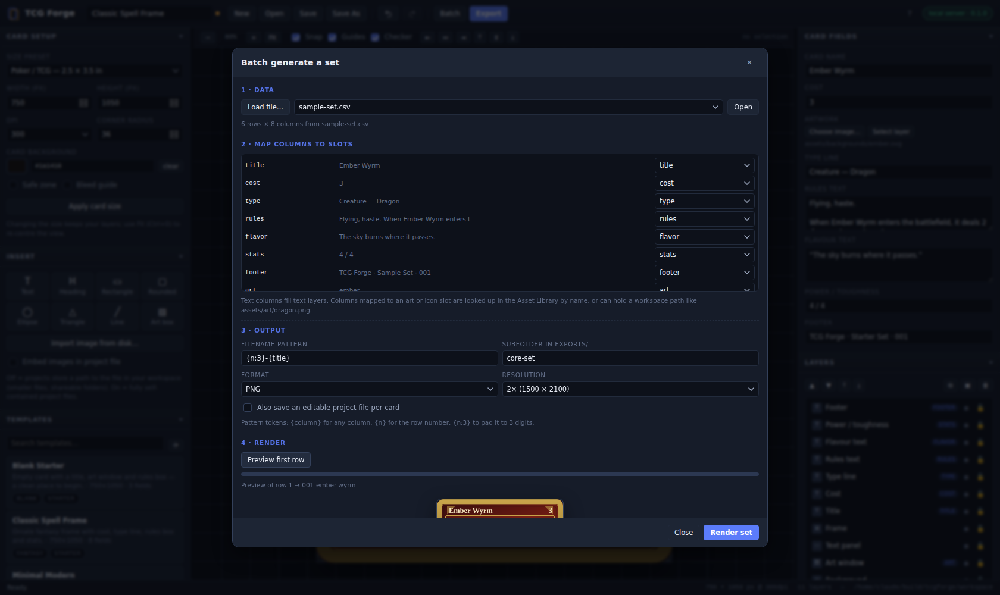

# Batch generation

Turn a spreadsheet into a finished card set. One template, one CSV, one click.

Open it with the **Batch** button in the top bar, or `Ctrl/⌘ + B`.



## How it works

Batch generation is built on the slot system: for every row it resets the card
to the current layout, writes the row's values into the matching slots, renders
the image, and saves it. Nothing accumulates between rows, so card 60 looks
exactly like card 1 with different words in it.

The canvas you started from is always restored when the run finishes — even if
a row fails or you cancel halfway.

## 1 · Data

Load a `.csv`, `.tsv` or `.json` file from anywhere on your disk, or drop it
into `workspace/batch/` and pick it from the list.

The CSV parser handles quoted fields, escaped quotes (`""`) and newlines inside
quotes, so exports from Excel, Numbers, Google Sheets and LibreOffice work
as-is. The delimiter is detected from the header row (`,` `;` tab `|`).

JSON is accepted as an array of objects:

```json
[
  { "title": "Ember Wyrm", "cost": "3", "rules": "Flying, haste." },
  { "title": "Void Pilgrim", "cost": "2", "rules": "Flying." }
]
```

A worked example ships in `workspace/batch/sample-set.csv` — six cards for the
*Classic Spell Frame* template, with a `qty` column asking for eighteen.

## 2 · Mapping

Every column is matched to a slot automatically when the names line up
(`title` → `title`, `Rules Text` → `rules`). Fix anything it got wrong with the
dropdowns, or set a column to *ignore*.

- **Text slots** take the cell value verbatim. Line breaks inside a quoted cell
  are preserved, and auto-fit shrinks text that would overflow its box.
- **Art and icon slots** resolve the cell to an image: an asset name from the
  library (`dragon`), a workspace path (`assets/art/dragon.png`), or a URL. The
  image is scaled to cover the slot and clipped to it.
- **An empty text cell clears that field** rather than leaving the template's
  placeholder copy on the card. An empty art cell leaves the placeholder alone.

## 3 · Output

| Setting | What it does |
| --- | --- |
| Filename pattern | `{column}` inserts any column, `{n}` the row number, `{n:3}` pads it to three digits. Names are slugified, so `{n:3}-{title}` gives `001-ember-wyrm.png`. |
| Subfolder | Groups the run inside `workspace/exports/`, e.g. `core-set`. |
| Format | PNG (lossless, transparency) or JPEG. |
| Resolution | 1× to 4× of the card's pixel size. 2× of a 750 × 1050 card is 1500 × 2100. |
| Save project files | Also writes an editable `.json` per card into `workspace/projects/<subfolder>/`, so any single card can be opened and tweaked afterwards. |
| Quantity column | How many of each card the deck wants. See below. |

Existing files with the same name are **overwritten** during a batch run — that
way re-running a set after a template tweak replaces it instead of piling up
`-2`, `-3` copies. Single exports never overwrite.

## 3a · Quantities

A real deck is four of one card and one of another. Rather than repeating a row
four times — which renders the same picture four times and names the copies as
if they were different cards — give the file a count column and point
**Quantity column** at it:

```
title,cost,rules,qty
Ember Wyrm,3,"Flying, haste.",4
Frostbite Colossus,6,Vigilance.,1
```

A column called `qty`, `quantity`, `count`, `copies`, `number` or `amount` is
picked up on its own; anything else you choose from the dropdown. Each card is
still rendered **once**. The counts are written beside the images as a small
`deck.json`:

```json
{
  "format": "tcgforge.deck",
  "version": 1,
  "name": "Sample Set",
  "designs": 6,
  "total": 18,
  "cards": [{ "file": "01-ember-wyrm.png", "qty": 4 }]
}
```

The print sheet builder finds that file on its own and lays out the right
number of copies — see [`PRINT.md`](PRINT.md). A blank, zero or unreadable cell
counts as one, and a single card is capped at 999 copies.

Leave the dropdown on *one of each* and no list is written, which is the
behaviour every run had before.

## 4 · Render

**Preview first row** renders row 1 without saving anything, so you can check
the mapping before committing to 200 cards.

**Render set** runs the whole file with a progress bar and a per-card log. The
button becomes **Cancel** while it runs; cancelling stops after the current card
and still restores your canvas.

Roughly: a 750 × 1050 card at 2× takes about a third of a second, so a
60-card set finishes in well under a minute.

## Scripting it

Everything the dialog does is available on `window.TCGForge` and the batch
module, so a whole set can be rendered from the browser console:

```js
const b = await import('/js/core/batch.js');
const text = (await (await fetch('/files/batch/sample-set.csv')).text());
const { columns, rows } = b.parseTable(text);
const mapping = Object.fromEntries(columns.map((c) => [c, c]));

await b.runBatch({
  rows,
  mapping,
  options: { multiplier: 2, pattern: '{n:3}-{title}', subfolder: 'core-set' },
  onProgress: ({ index, total, name }) => console.log(`${index + 1}/${total} ${name}`),
});
```

## Tips

- Keep one CSV per template. Column names that match slot ids make the mapping
  step disappear.
- Put the artwork filenames in a column and drop the files into
  `workspace/assets/art/` — the library lookup is by filename without the
  extension, so `dragon.png` is just `dragon`.
- Rendering happens in the page, so leave the tab focused for the fastest run;
  browsers throttle timers in background tabs.
